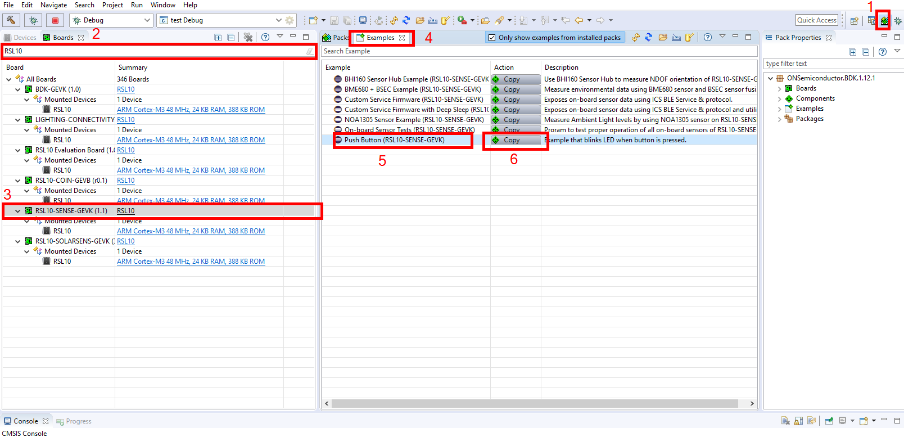

# Setup based project

This guide will show you how to setup a based project, how to navigate around the IDE, and how to setuo the debug instance. 

## Start new Project
Normally, the Push Button Example is used as the project starter becasue it is initialized with minimal system configuration (IOs, debug interface...). Follow the pictures for starting a new project. 

1. Click CMSIS pack manager
2. Enter RSL10
3. Choose RSL10-SENSE-GEVK
4. Choose example tab
5. Choose Push Button Example
6. Click Copy

Press the compile button (hammer icon) to compile the project if the project is correctly generated. 

It is a good idea to rename your project. For my case, it is changed into "Based Project"

## Config the SDK

1. Double click on your .rteconfig file. This file contains the SDK configuration for your project.
2.  This area contains the configuration, here you can add/remove software components, e.g. RTOS, BLE profile, peripherals...

You can also activate the RTT (Real-Time Transfer) and redirect printf to use with RTT for printing logging info.

## Setup the Debug

1. Click the Debug symbol
2. Choose Debug Configuration

Double click the option GDB SEGGER J-Link

1. Choose Main tab
2. If the field C/C++ Application is empty, choose Browse and choose the .elf file in the Debug folder

1. Choose Debugger tab
2. If Device name is empty, type RSL10
3. Click apply
4. Click Debug
   
   
## Change log

### Version 1.0
Initial version